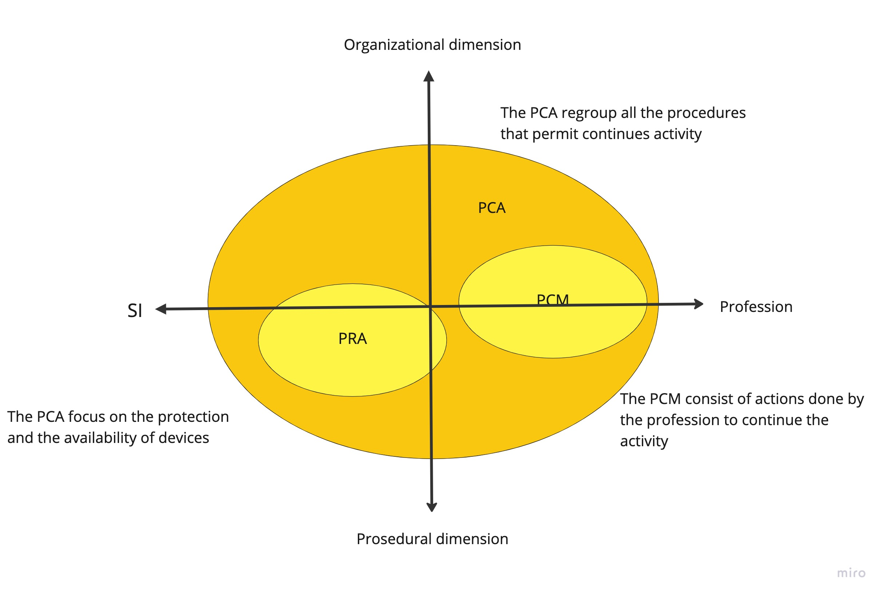

# Actvity plan
## Actvity plan goals
- Projecting into non normal events
- Imagine that the system can be shutdown
- Respect a minimum return to normal delay 
- Apply testing mesures

## PCA 

### PRA (Recovery plan)
#### Phase 1: Analyze needs and evaluate scenarios

- Impact analysis of major incidents on metric processes
- Identification of the perimeter to be rescued through exchange mapping
- Elaboration and comparison of potential technical scenarios
#### Phase 2: Implementation

- Implement technical solutions to ensure necessary rescue
- Creation of a Documentation Reference describing technical solutions and procedures
#### Phase 3: Testing and continuous maintenance

- Test the effectiveness of the PRA before an incident occurs
- Test the infrastructure and procedures through integrated exercises as part of continuous maintenance process.

## PCA goal
The implementation of a PRA also has an important organizational component that must not be neglected. The main technical challenge is secure data storage. The recovery of a Datacenter is typically done in Y with a production site (Site 1) replicated synchronously to a backup site (Site 2) and asynchronously to a PRA site (Site C) hosting backup application servers.