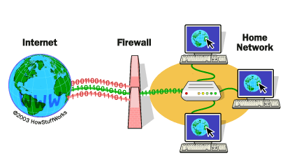
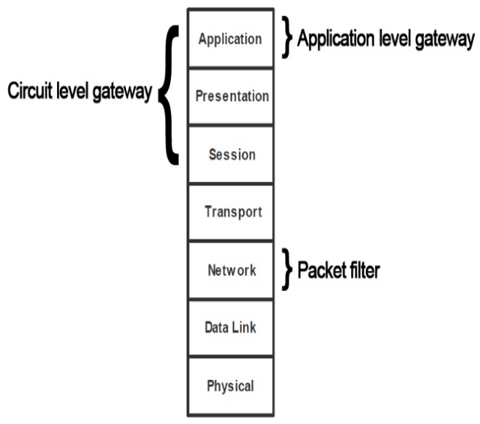

# Elements

- Backups
- Antviruses
- Firewalls, filters and proxies
- Load balancers
- Vulnerability auditing tools (Scanner)
- Virtual private networks
- Intrusion detection/prevention systems
- Honeypots
Authentication servers
- Key servers

## Backups
### Backups policies 
- Full
- Incrmentale 
- Diferentelle

## Antviruses
Antivirus are programs installed on the user machine to protet against viruses.

## Firewalls

### Baston Architecture
A baston is machine to protect, this machine is often found in a non secure zone (or a DMZ)

To protect this system you need to 
- remove non used services
- fix bugs 
- remove all default user accounts
- monitor acces 
- log events
- backup

### Firewall technologies
- Packet filtering (screening)
    - For Routers : cisco, 3com
    - For Hosts : Karlbridge, TCP wrapper
- Proxy (proxying)
    - Application layer : Squid, MS ISA
    - Circuit level : Socks, updrelay
- Stateful Packet Inspecton (SPI)
    - Stateful Multiplayer inspection

# Load Balancers
To make sure our system is wokring even when there is high trafic what we do is putting in place a load blancer, a load balancer can be physical or just software and this solution will help balance traic between machines.

some algorithmes used : 
- Round Robin
- Hash 
- Response Time
- Least connection
- Bandwidth

# VPNs (Virtual Private Networks)
VPN (Virtual Private Network) is defined as a physically or logically separated network that is interconnected by virtual communication links. The term "virtual" is used because the link does not exist physically
## Protocles 
- AH (Authentifiation Hader)
    - Integrity of data
    - Authentiffication
    - Algo : HMAC-MD5, HMAC-SHA1
- ESP (Encapsulatng Security Payload)
    - Integrity of data
    - Authentiffication
    - Confdentality
    - Akgo ; 3DES-CBC, AES-CBC

## Protectioon strategy 
- End2End
- Between session
- Hop-by-Hop