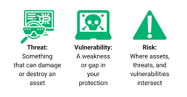

# Defniton of risk

## Type of threats
### Hackers 
- Script kiddies : just a kid with an offensive tool most of the time they can deal alot of damage just because companies don't really put alot of effort in cybersecurity
- the wreckers (saboteurs) : people with the objective of putting down the whole infra or certain part of it 
- Hunters : target system that can give the most of fame the information insides these system don't really matter for them
- Spies : they are hard to detect beacause their whole goal is to stay in the shadows and blend with the eco-system
- Thiefs = their objective is to just steal money 
- Clumsy : people who often do alot of mistakes and don't learn from them these are people that can put the back and the app in the same server or can also delete the app by mistake

### Attaccks by Vulnerabilites 
- Vuirus, worms and software bombs
- Trojan horses (Troyan Horse)
- Backdoors (Back-door, RootKit)
- Spoofing (Spoofng)
- Link spying (Wiretapping // WarDriving)
- Unsecured access
- Denial of access (Denial of Services and Distributed DoS)
- Excessive transparency // Social engineering
- Bug Exploitation
- BotNet
- RansomWare

### Other Threats 
- Natural problems (earthquake, tornados)
